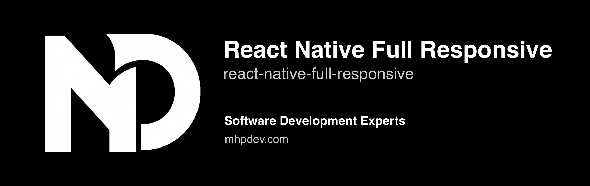

<p align="center">
  <a href="https://mhpdev.com" target="_blank">
    
  </a>
</p>

<h3 align="center">
  Create a fully responsive React Native app for all supported platforms
</h3>

<div align="center">
  <a href="./USAGE.md">Documentation</a> · <a href="/example/src/">Examples</a>
</div>

## 📢 Introduction

This package makes it super easy to create apps responsive that work perfectly on all different screen sizes in React Native (like font size, width, height, and more), making sure everything looks great on any device, from extra small to extra large. You can also tweak how things scale and adjust settings to make everything just the way you want it.

<table width="100%">
  <tr>
    <td align="center"  width="24%">
      <a href="./sim-2x.png" target="_blank">
        
      </a>
    </td>
    <td align="center" width="24%">
      <a href="./sim-1x.png" target="_blank">
        
      </a>
    </td>
    <td align="center" width="24%">
      <a href="./sim-3x.png" target="_blank">
        
      </a>
    </td>
    <td align="center" width="24%">
      <a href="./sim-4x.png" target="_blank">
        
      </a>
    </td>
  </tr>
  <tr>
    <td align="center"><sub>iPhone 15 Pro Max</sub></td>
    <td align="center"><sub>iPhone SE (3rd gen)</sub></td>
    <td align="center"><sub>iPad Pro (12.9-inch)</sub></td>
    <td align="center"><sub>Web</sub></td>
  </tr>
</table>

## 💫 Features

- Easy to use: Effortlessly implement size scaling and responsive design.
- Cross-platform: Works seamlessly across multiple platforms and devices.
- [createRStyle](./USAGE.md#createrstyle) method and [useRStyle](./USAGE.md#userstyle) hook as alternatives to using `StyleSheet.create` for create stylesheets.
- Various responsive hooks provided: Use these hooks based on your specific use cases.
- Customizable scaling: Define base widths for specific dimension types `(xs, sm, ... 2xl)` for precise control.
- Responsive percentage-based sizing: Adjust sizing based on width or height by `PixelRatio`.
- Media query hook: Detect dimension types by using the [useMediaQuery](./USAGE.md#usemediaquery-usemq) hook. You can also override default thresholds as needed. This hook can be used in the provider to automatically detect and respond based on the configurations.
- Various responsive Higher-Order Components (HOCs) provided: Utilize these methods in your class components.
- Written in TypeScript and fully typed.

## 📀 Installation

**Supported for React Native >= 0.60**<br/>

```sh
yarn add react-native-full-responsive

//or

npm install react-native-full-responsive --save
```

## 🚀 Quick Start

**_Starting from v2, you can easily create your styles using the `createRStyle` or `useRStyle` hooks_**

Use [createRStyle](./USAGE.md#createrstyle) in a similar way to when you use `StyleSheet.create`:

```tsx
import * as React from 'react';
import { View, Text } from 'react-native';
import { createRStyle } from 'react-native-full-responsive';

const SIZE = 20;

export default function App() {
  return (
    <View style={styles.container}>
      <View style={styles.box}>
        <Text style={styles.textBold}>My awesome responsive text!</Text>
      </View>
    </View>
  );
}

const styles = createRStyle({
  container: {
    flex: 1,
    alignItems: 'center',
    justifyContent: 'center',
  },
  box: {
    height: `${SIZE * 3}rs`,
    justifyContent: 'center',
    backgroundColor: 'yellow',
    marginVertical: `${SIZE}rs`,
    paddingHorizontal: `${SIZE / 2}rs`,
  },
  textBold: {
    fontWeight: 'bold',
    fontSize: `${SIZE}rs`,
  },
});
```

Alternatively, use [useRStyle](./USAGE.md#userstyle) to create dynamic styles that change when dimensions, bases, or types are modified:

```tsx
import * as React from 'react';
import { View, Text } from 'react-native';
import { FRProvider, useRStyle } from 'react-native-full-responsive';

const SIZE = 20;

const ResponsiveBox: React.FC = () => {
  const styles = useRStyle({
    container: {
      flex: 1,
      alignItems: 'center',
      justifyContent: 'center',
    },
    box: {
      height: `${SIZE * 3}rs`,
      justifyContent: 'center',
      backgroundColor: 'yellow',
      marginVertical: `${SIZE}rs`,
      paddingHorizontal: `${SIZE / 2}rs`,
    },
    textBold: {
      fontWeight: 'bold',
      fontSize: `${SIZE}rs`,
    },
  });

  return (
    <View style={styles.container}>
      <View style={styles.box}>
        <Text style={styles.textBold}>My awesome responsive text!</Text>
      </View>
    </View>
  );
};

export default function App() {
  return (
    <FRProvider type="sm">
      <ResponsiveBox />
    </FRProvider>
  );
}
```

Alternatively, make use of the responsive methods and hooks that are available from v1:

```tsx
import * as React from 'react';
import { Text } from 'react-native';
import { useRM, FRProvider } from 'react-native-full-responsive';
//...

const MyComponent = () => {
  const { rs } = useRM();

  const scaledValue = rs(20);

  return (
    <Text style={{ fontSize: scaledValue }}>My awesome responsive text!</Text>
  );
};

export default function App() {
  return (
    <FRProvider>
      <MyComponent />
    </FRProvider>
  );
}
```

To become more familiar with how to use methods within your function or class components, check out the provided [examples](./example/src/).

Also, if you're looking to become more familiar with how to use the package as a universal responsive utility, check out [Todo App](https://github.com/Mhp23/todo-app-client) project for a practical example

## 📚 Documentation

Explore the [usage documentation](./USAGE.md) to discover how to leverage the methods, hooks, and other features.

## 🤝 Contribution

See the [contributing guide](CONTRIBUTING.md) to learn how to contribute to the repository and the development workflow.

## 🧪 Test

To mock the package's methods and components using the default mock configuration provided, follow these steps:

- Create a file named `react-native-full-responsive.ts` inside your `__mocks__` directory.

- Copy the following code into that file:

  ```ts
  export * from 'react-native-full-responsive/jest';
  ```

## 🛡️ License

MIT
